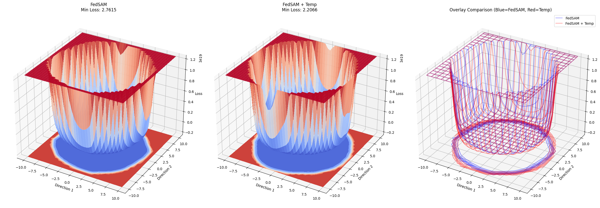

# Some Like It Cold: Temperature-Conditioned Data Heterogeneity Mitigation in Federated Learning

##  Loss Landscape Flattening with TempNet



*3D loss landscape visualization comparing FedSAM (vanilla) and FedSAM+Temp. The TempNet-augmented model exhibits a flatter basin, suggesting reduced sharpness and better generalization.*

---

##  Problem Statement

Federated Learning (FL) enables collaborative model training across decentralized devices while preserving privacy. However, **heterogeneous client data** (non-i.i.d. distributions) causes significant performance degradation due to:

- **Client drift**: Local models diverge from the global objective
- **Weight divergence**: Inconsistent parameter updates across clients
- **Suboptimal aggregation**: Static hyperparameters fail to account for unique client distributions

---

##  Our Approach

We introduce **TempNet**, a lightweight neural network that learns client-adaptive **dynamic temperature scaling** ($\tau$) during local training. Unlike static temperature methods, TempNet:

✓ **Adapts per-client**: Each client learns its own temperature parameter  
✓ **Privacy-preserving**: TempNet parameters remain local (not aggregated)  
✓ **Theoretically grounded**: Implements implicit inverse-variance weighting  
✓ **Computationally efficient**: ~130K parameters, negligible overhead  

---

##  Key Findings

### Performance Across Heterogeneity Settings


| Algorithm | CIFAR-10 Base | CIFAR-10 +Temp | CIFAR-10 Δ% | CIFAR-100 Base | CIFAR-100 +Temp | CIFAR-100 Δ% | PACS Base | PACS +Temp | PACS Δ% |
|----------|---------------|----------------|-------------|---------------|-----------------|--------------|-----------|------------|----------|
| FedAvg | 0.5410 | 0.5628 | <span style="color:green;">+2.18</span> | 0.2478 | 0.2654 | <span style="color:green;">+1.76</span> | 0.4189 | 0.3950 | <span style="color:red;">−2.39</span> |
| FedSAM | 0.5677 | 0.5913 | <span style="color:green;">+2.36</span> | 0.2653 | 0.2807 | <span style="color:green;">+1.54</span> | 0.4472 | 0.4591 | <span style="color:green;">+1.19</span> |
| FedLESAM | 0.5733 | 0.5798 | <span style="color:green;">+0.65</span> | 0.2555 | 0.2757 | <span style="color:green;">+2.02</span> | 0.3991 | 0.4770 | <span style="color:green;">+7.79</span> |
| FedSMOO | 0.6288 | 0.6245 | <span style="color:red;">−0.43</span> | 0.2985 | 0.2987 | <span style="color:green;">+0.02</span> | 0.3917 | 0.4520 | <span style="color:green;">+6.03</span> |
| FedGMT | 0.5610 | 0.5259 | <span style="color:red;">−3.51</span> | 0.2647 | 0.2614 | <span style="color:red;">−0.33</span> | 0.3515 | 0.4581 | <span style="color:green;">+10.66</span> |
| FedProx | 0.5450 | 0.5678 | <span style="color:green;">+2.28</span> | 0.2520 | 0.2706 | <span style="color:green;">+1.86</span> | 0.3780 | 0.4177 | <span style="color:green;">+3.97</span> |


*CIFAR-10/100 use Dirichlet label skew (α=0.5); PACS exhibits feature skew with Sketch as target domain.*

### Highlights

 **Up to +10.66% accuracy gain** on domain generalization (PACS)  
 **Up to +2.36% improvement** on CIFAR-10 with label skew  
 **84.09% sharpness reduction** compared to vanilla FedSAM  
 **Strong correlation (r=0.809)** between learned temperatures and optimal inverse-variance weights  

---

##  Theoretical Contributions

**Proposition 1**: Temperature $\tau_i$ adapts proportionally to gradient variance $\sigma_i^2$, enabling automatic heterogeneity handling.

**Proposition 2**: Temperature-scaled aggregation approximates optimal inverse-variance weighting:

$$w_i^{\text{eff}} = \frac{1/\tau_i}{\sum_{j=1}^K 1/\tau_j} \approx w_i^* = \frac{1/\sigma_i^2}{\sum_{j=1}^K 1/\sigma_j^2}$$

**Empirical Validation**:
- Causal intervention analysis confirms gradient variance → temperature adaptation
- Temperature scaling contributes **91.8%** of total performance improvement
- Flatter loss landscapes verified through Hessian eigenvalue analysis

---

## 📂 Repository Structure

```
SLIC/
├── README.md                 # This file
├── LICENSE                   # Project license
│
├── primary_study/
│   └── SLIC-pacs-DG.ipynb   # Primary experiments: PACS domain generalization
│
├── ablations/
│   ├── SLIC-abl1-Empirical Validation of Optimal Weight Learning.ipynb
│   ├── SLIC-abl2-Global Model Sharpness.ipynb
│   ├── SLIC-abl3-Causal Validation.ipynb
│   ├── SLIC-abl4-Epoch-Level Dynamics.ipynb
│   └── SLIC-abl5-Per-Unit Temp Effects.ipynb
│
└── misc/
    └── flatness3d.png        # Loss landscape visualization
```


---

## 📄 Paper

**Authors**: Ahmad Ashraf, Sarim Malik

- **Note:** Manuscript not added to Github. Preprint not available for distribution

---

## Contact

For questions or collaborations, reach out via GitHub issues or email the authors.